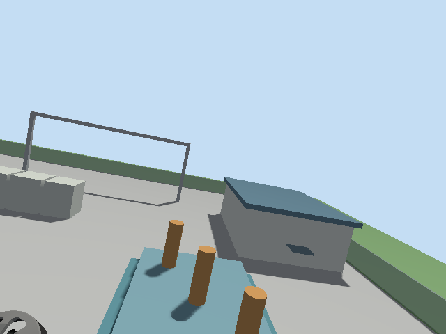
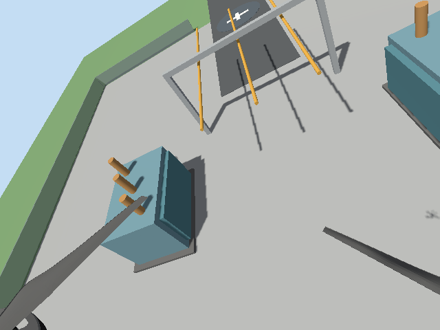

# Autonomous UAV Energy Inspection

Portfolio project demonstrating autonomous electrical-infrastructure inspection
with **ROS 2 Jazzy**, **PX4 SITL**, **Gazebo Harmonic**, and Python.

The simulated UAV launches in a custom substation, flies an autonomous
five-asset route, captures a camera frame and vehicle position at every
inspection point, returns to its landing pad, and creates a browser-readable
mission report.

> Simulation only. The flight nodes are not intended for real aircraft.

## Current capabilities

- ROS 2 communication with PX4 through Micro XRCE-DDS
- PX4 Offboard arming, takeoff, waypoint control, return, and landing
- Custom Gazebo electrical-substation environment
- Lightweight camera-equipped custom X500 model
- Five inspection viewpoints with asset-specific altitude and yaw
- Timestamped PNG evidence and CSV telemetry
- Automatically generated HTML inspection report
- Failsafe and landing-result verification in the test runner





## System flow

```text
ROS 2 mission node -> PX4 Offboard setpoints -> PX4 SITL -> Gazebo UAV
        ^                                                   |
        |----------- PX4 telemetry + camera frames ---------|
                              |
                        CSV + PNG + HTML
```

## Repository structure

```text
uav_energy_inspection/      ROS 2 Python nodes
scripts/                    repeatable end-to-end test runners
worlds/                     custom substation SDF world
models/inspection_x500/     custom camera-equipped PX4 model
launch/                     ROS 2 launch files
docs/showcase/              verified example mission output
```

## Milestone 2: ROS 2 offboard flight

The `offboard_mission` node controls PX4 SITL only. It waits for healthy PX4
telemetry, warms up the offboard setpoint stream, arms, climbs to 2 metres,
hovers for 8 seconds, and requests an automatic landing.

PX4 uses the NED coordinate frame, so 2 metres above the origin is `z = -2.0`.

Run the DDS Agent and PX4 Gazebo simulation first, then:

```bash
source /opt/ros/jazzy/setup.bash
source ~/uav_ws/install/setup.bash
ros2 run uav_energy_inspection offboard_mission
```

For PX4 builds that require a connected GCS before arming, the package also
provides `sitl_gcs_heartbeat`. It only advertises a local simulation GCS on UDP
14550; it does not send flight commands.

The test runner launches `worlds/energy_substation.sdf`, a custom portfolio
environment with a landing pad, fenced yard, transformers, switchgear, bus
gantries, a control building, and five yellow inspection markers.

To keep Gazebo open after the automatic landing, run:

```bash
KEEP_GAZEBO_OPEN=1 ~/uav_ws/src/uav_energy_inspection/scripts/run_milestone2_test.sh
```

## Milestone 3: autonomous inspection route

The `waypoint_inspection` node climbs to a safe cruise altitude, visits all five
yellow inspection markers, holds at each asset, records the measured PX4
coordinates to a timestamped CSV in `data/`, returns to the landing pad, and
lands automatically.

The camera-equipped mission saves one real Gazebo camera frame per asset and
generates `inspection_report.html` beside the CSV. The report deliberately
records only image capture evidence; it does not claim automatic defect
detection.

The custom `inspection_x500` model uses a 640×480 camera at 10 FPS so Gazebo
can maintain useful simulation speed while still producing clear evidence.

```bash
~/uav_ws/src/uav_energy_inspection/scripts/run_milestone3_inspection.sh
```

The latest generated run is written to:

```text
~/uav_ws/src/uav_energy_inspection/data/inspection_mission_<timestamp>/
```

Each run contains `inspection_data.csv`, `inspection_report.html`, and an
`images/` directory. A verified example is committed under `docs/showcase/`.

## Verified result

The showcase mission completed all five inspection points, captured all five
images, returned to the launch area, landed and disarmed with PX4 failsafe
remaining false.

## Roadmap

- [x] ROS 2 and PX4 SITL communication
- [x] Automatic takeoff, hover, and landing
- [x] Custom energy-substation simulation
- [x] Five-point autonomous inspection route
- [x] Camera evidence, CSV telemetry, and HTML report
- [ ] Simulated thermal, oil-leak, corrosion, and insulator defects
- [ ] OpenCV-based defect detection and annotated evidence
- [ ] Severity classification and report dashboard
- [ ] Automated tests and demonstration video

## Technology

ROS 2 Jazzy · PX4 Autopilot SITL · Gazebo Harmonic · Python · OpenCV ·
Micro XRCE-DDS
